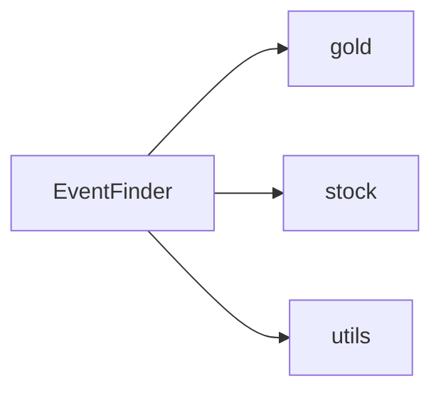

# EventFinder

Two jobs. Open the one you want.

| Go here | What you get |
|---|---|
| [gold](gold/README.md) | Gold scripts, gold launchers, and gold price files |
| [stock](stock/README.md) | Stock scripts, stock launchers, and NSE price files |
| [utils](utils/README.md) | Shared pivot rules and the control page used by both |

Run commands from this folder.
