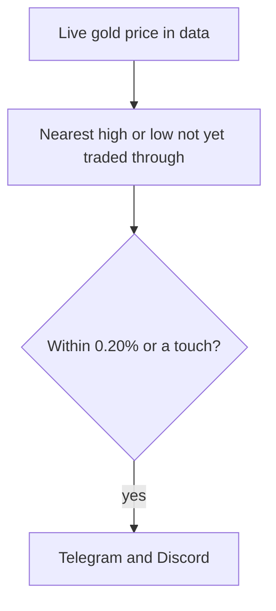

# Gold

Live CoinDCX gold alerts. Price comes near a drawn high or low, and this sends a message.



Levels are the 2-year, 1-year, monthly, weekly, and daily highs and lows, plus the previous day's high and low, and today's high and low after price has moved 1% away.

## In this folder

- `xauusd_event_finder.py` — watch price and fire the alert
- `coindcx_gold.py`, `download_gold_xauusd.py` — download CoinDCX bars
- `tradingview_gold.py`, `download_tv_xauusd.py`, `tv_data/` — optional TradingView bars
- `run_xauusd_event_finder.bat` — start the watch
- `find_chat_id.bat`, `get_chat_id.py` — Telegram chat id
- `telegram_notifier.py`, `discord_notifier.py` — send the alerts
- `config.yml` — distances and on/off switches
- `data/` — daily bars, 1-minute bars, and the event log
- `plot_*.py`, `replay_last_week_events.py` — charts and a replay of last week

From the EventFinder folder:

```powershell
python gold\xauusd_event_finder.py
```

Alert secrets are in `utils/.env`. The page that turns alerts on and off is in [utils](../utils/README.md).
