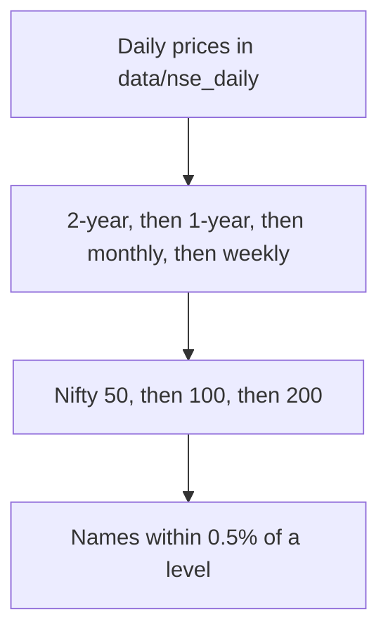

# Stocks

NSE names whose latest close is near a key support or resistance level.



## In this folder

- `screen_levels.py` — build the list
- `scheduler_run.py` — one scheduled run
- `manage_scheduler.py` — install or change the Windows times
- `run_screener.bat`, `run_screener.vbs` — what the weekday tasks start
- `open_latest.bat` — open the latest list
- `download_nse_daily.py`, `download_nse_hourly.py`, `update_data.py` — price files
- `scrape_moneycontrol_stocks.py`, `run_moneycontrol.bat` — Moneycontrol names
- `export_watchlist.py` — dated watchlist file
- `config.yml` — run times, tolerance, and output folders
- `data/` — NSE bars, index lists, and `screener_output/latest.html`
- `Results/` — saved watchlist files

From the EventFinder folder:

```powershell
python stock\screen_levels.py
python stock\manage_scheduler.py status
```

The list is rebuilt at the times in `config.yml`. During market hours it publishes names. After the close it updates prices and does not publish a new list.
